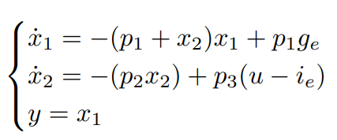

# Blood glucose regulation system
## Context
This is a project work that I developed for the MSc Computer Engineering course on Nonlinear Control at University of Salerno, Italy.

## Introduction
The aim of the project is to evaluate the performances of a given controller for the regulation of blood glucose levels in a diabetic patient, as well as to develop alternative controllers based on more advanced linear and nonlinear control techniques. Finally, the performances of the proposed controllers must be critically analyzed in order to propose the final solution. The mathematical model of the glucose-insulin system is given.

Some of the control techniques that are exploited in this project work are:
- Feedback linearization controller;
- Gain scheduling controller;
- State Feedback controller for a nonlinear system;
- Linear Quadratic Regulator (LQR);
- Linear Quadratic Integral (LQI);
- State Observer for a nonlinear system;
- PID control for a nonlinear system.

In order to design the proposed controllers and analyze their performances, several techniques were employed:
- Phase Plane;
- Root Locus;
- Bode and Nyquist diagrams;
- Pole placement.

For each controller, the performance is evaluated in terms of settling time, overshoot, and tracking of references.

## Project structure
The project is organized into work packages, each of them representing a different task. Specifically:
- WP1: Anlysis of the system and identification of the limitations a given controller v0. The controller is based on state feedback on a linearized system around an equilibrium point.

- WP2: Design a new controller, v1, which is still linear but improves the performance of the closed loop (highlighting rise time, settling time, over-elongation). Then evaluate the controller obtained (r(t) = 0.0451);

- WP3: Design a state observer for the variable $x_2$ in order to use the controller v1 even when $x_2$ can't be directly measured; 

- WP4: Design a new controller, v2, based on Feedback Linearization. Evaluate the controller and compare its performance with v1. Design an extension of the controller to chase time-varying references;

- WP5: Design a new controller, v3, based on Gain Scheduling. Evaluate the controller and compare its performance with v2. Provide simulation diagrams for time-varying references.

## Dynamical model
The dynamics of the system is described by the followind ODEs:

Where the parameters have the following meanings:
- $p_1 = 0.0151 min^{-1}$ is the rate of glucose removal from the blood indipendently of the level of insulin;
- $p_2 = 0.0313 min^{-1}$ the rate of glucose removal given by the action of insulin; 
- $p_3 = 0.0097 l/(min^2 U)$ the uptake capacity given by insulin, 
- $g_e = 0.97 g/l$ the equilibrium values of glucose;
- $i_e = 0.003 U/l$ the equilibrium values of insulin;

The state variables are:
- $x_1$: Blood glucose concentration, mesured in $g/l$.
- $x_2$: Insulin concentration in interstitial fluids measured in $min^{-1}$. The concentration of insulin in the interstitial fluids influences the concentration of glucose in the blood $x_1$ because thanks to insulin, the cells recall glucose into the blood and thus $x_1$ is lowered.

The control input u(t) is the insulin present in the blood, measured in U/l. The concentration of insulin in the blood influences the concentration of insulin in the interstitial fluids $x_2$. Insulin is injected into the blood and then passes to the interstitial fluids.
<!--
## Project implementation
The project is implemented in Matlab and Simulink. The choice of Matlab is due to the fact that it is a widely used tool for control systems and it provides a lot of useful functions and tools to implement the controllers and to analyze the system. 
Several controllers are implemented and compared to each other. The controllers are implemented in the form of Simulink blocks, so that they can be easily integrated into the simulation environment.
Each folder contains the implementation of a specific Work Package (WP) as described in the previous section.
For each WP, the following files are provided:
- WPX.m: The main script that runs the simulation and plots the results;
- XXX.slx: The Simulink model of the controllers. 
- WPX.mlx: The live script that contains the code of the WPX.m script and the comments (the comments are available only in Italian);

Note that more controllers are implemented for each WP, so that the performance of the different controllers can be compared within the same WP, and the best controller of each WP can be compared with the best controller of the other WPs.-->
